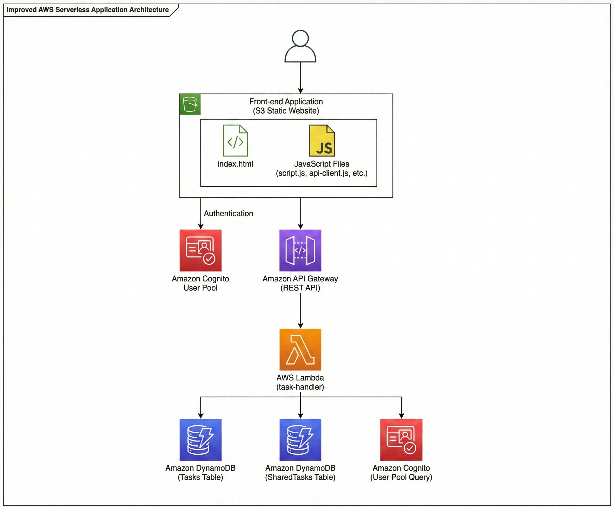

# CloudTodo API 文件
## 系統架構



## 認證

所有 API 請求都需要在 header 中包含有效的 Cognito JWT Token：

```
Authorization: Bearer <cognito-jwt-token>
```

---

## API 端點

### 1. 獲取任務列表

**GET** `/tasks`

獲取當前用戶的所有任務，包括自己創建的任務和別人分享的任務。

**請求參數：** 無

**回應範例：**
```json
{
  "tasks": [
    {
      "userId": "user-123",
      "taskId": "1703318400000-abc123",
      "title": "完成報告",
      "description": "期末專題報告",
      "category": "work",
      "priority": 2,
      "dueDate": "2025-12-25T14:00:00",
      "completed": false,
      "createdAt": "2025-12-23T10:00:00.000Z",
      "updatedAt": "2025-12-23T10:00:00.000Z"
    }
  ],
  "sharedTasks": [
    {
      "userId": "owner-456",
      "taskId": "1703318500000-def456",
      "title": "團隊會議",
      "description": "討論專案進度",
      "category": "work",
      "priority": 1,
      "dueDate": "2025-12-24T10:00:00",
      "completed": false,
      "createdAt": "2025-12-22T08:00:00.000Z",
      "updatedAt": "2025-12-22T08:00:00.000Z",
      "ownerEmail": "owner@example.com",
      "isShared": true
    }
  ]
}
```

---

### 2. 創建新任務

**POST** `/tasks`

創建一個新的任務。

**請求 Body：**
```json
{
  "title": "任務標題",
  "description": "任務描述（選填）",
  "category": "work",
  "priority": 2,
  "dueDate": "2025-12-25T14:00:00"
}
```

**欄位說明：**
- `title` (必填): 任務標題
- `description` (選填): 任務描述
- `category` (選填，預設 "personal"): 任務分類
- `priority` (選填，預設 "medium"): 任務優先級
- `dueDate` (選填): 截止日期時間（ISO 8601 格式）

**回應範例：**
```json
{
  "userId": "user-123",
  "taskId": "1703318400000-abc123",
  "title": "任務標題",
  "description": "任務描述",
  "category": "work",
  "priority": 2,
  "dueDate": "2025-12-25T14:00:00",
  "completed": false,
  "createdAt": "2025-12-23T10:00:00.000Z",
  "updatedAt": "2025-12-23T10:00:00.000Z"
}
```

**HTTP 狀態碼：** `201 Created`

---

### 3. 更新任務

**PUT** `/tasks/{taskId}`

更新指定任務的資訊。只有任務擁有者可以編輯。

**請求 Body：**
```json
{
  "title": "更新的標題",
  "description": "更新的描述",
  "category": "personal",
  "priority": 3,
  "dueDate": "2025-12-26T10:00:00",
  "completed": true
}
```

**欄位說明：** 所有欄位皆為選填，只更新提供的欄位。

**回應範例：**
```json
{
  "userId": "user-123",
  "taskId": "1703318400000-abc123",
  "title": "更新的標題",
  "description": "更新的描述",
  "category": "personal",
  "priority": 3,
  "dueDate": "2025-12-26T10:00:00",
  "completed": true,
  "createdAt": "2025-12-23T10:00:00.000Z",
  "updatedAt": "2025-12-23T12:00:00.000Z"
}
```

**錯誤回應：**
```json
{
  "message": "Permission denied"
}
```
**HTTP 狀態碼：** `403 Forbidden`

---

### 4. 刪除任務

**DELETE** `/tasks/{taskId}`

刪除指定任務。只有任務擁有者可以刪除任務。

**請求參數：** 無

**回應範例：**
```json
{
  "message": "Task deleted successfully"
}
```

**HTTP 狀態碼：** `200 OK`

**權限：** 只有任務擁有者可刪除

**錯誤回應：**
```json
{
  "message": "Only owner can delete task"
}
```
**HTTP 狀態碼：** `403 Forbidden`

---

### 5. 獲取共享任務列表

**GET** `/shared-tasks`

獲取所有分享給當前用戶的任務。

**請求參數：** 無

**回應範例：**
```json
{
  "tasks": [
    {
      "userId": "owner-456",
      "taskId": "1703318500000-def456",
      "title": "團隊會議",
      "description": "討論專案進度",
      "category": "work",
      "priority": 1,
      "dueDate": "2025-12-24T10:00:00",
      "completed": false,
      "createdAt": "2025-12-22T08:00:00.000Z",
      "updatedAt": "2025-12-22T08:00:00.000Z",
      "ownerEmail": "owner@example.com",
      "isShared": true
    }
  ]
}
```

---

### 6. 分享任務

**POST** `/tasks/{taskId}/share`

將任務分享給其他用戶。

**請求 Body：**
```json
{
  "email": "user@example.com",
  "permission": "read"
}
```

**欄位說明：**
- `email` (必填): 被分享用戶的 Email
- `permission` (必填): 分享權限，可選值：
  - `"read"`: 唯讀權限，只能查看任務
  - `"edit"`: 編輯權限，可以修改任務內容

**回應範例：**
```json
{
  "message": "Task shared successfully",
  "share": {
    "sharedWithUserId": "user-789",
    "taskId": "1703318400000-abc123",
    "ownerId": "user-123",
    "permission": "read",
    "sharedWithEmail": "user@example.com",
    "sharedAt": "2025-12-23T12:00:00.000Z"
  }
}
```

**HTTP 狀態碼：** `200 OK`

**權限：** 只有任務擁有者可以分享

**錯誤回應：**

用戶不存在：
```json
{
  "message": "User not found"
}
```
**HTTP 狀態碼：** `404 Not Found`

無權限：
```json
{
  "message": "Only task owner can share"
}
```
**HTTP 狀態碼：** `403 Forbidden`

無效的權限值：
```json
{
  "message": "Invalid permission. Must be \"read\" or \"edit\""
}
```
**HTTP 狀態碼：** `400 Bad Request`

不能分享給自己：
```json
{
  "message": "Cannot share with yourself"
}
```
**HTTP 狀態碼：** `400 Bad Request`

---

### 7. 獲取任務分享列表

**GET** `/tasks/{taskId}/shares`

獲取指定任務的所有分享記錄。

**請求參數：** 無

**回應範例：**
```json
{
  "shares": [
    {
      "sharedWithUserId": "user-789",
      "taskId": "1703318400000-abc123",
      "ownerId": "user-123",
      "permission": "read",
      "sharedWithEmail": "user1@example.com",
      "sharedAt": "2025-12-23T12:00:00.000Z"
    },
    {
      "sharedWithUserId": "user-456",
      "taskId": "1703318400000-abc123",
      "ownerId": "user-123",
      "permission": "edit",
      "sharedWithEmail": "user2@example.com",
      "sharedAt": "2025-12-23T13:00:00.000Z"
    }
  ]
}
```

**HTTP 狀態碼：** `200 OK`

**權限：** 只有任務擁有者可以查看分享列表

**錯誤回應：**
```json
{
  "message": "Only task owner can view shares"
}
```
**HTTP 狀態碼：** `403 Forbidden`

---

### 8. 更新分享權限

**PUT** `/tasks/{taskId}/share/{sharedUserId}`

更新指定用戶的分享權限。

**請求 Body：**
```json
{
  "permission": "edit"
}
```

**欄位說明：**
- `permission` (必填): 新的權限，可選值：`"read"` 或 `"edit"`

**回應範例：**
```json
{
  "message": "Permission updated",
  "share": {
    "sharedWithUserId": "user-789",
    "taskId": "1703318400000-abc123",
    "ownerId": "user-123",
    "permission": "edit",
    "sharedWithEmail": "user@example.com",
    "sharedAt": "2025-12-23T12:00:00.000Z"
  }
}
```

**HTTP 狀態碼：** `200 OK`

**權限：** 只有任務擁有者可以更新權限

**錯誤回應：**
```json
{
  "message": "Only task owner can update permissions"
}
```
**HTTP 狀態碼：** `403 Forbidden`

---

### 9. 移除分享

**DELETE** `/tasks/{taskId}/share/{sharedUserId}`

移除任務的分享權限。

**請求參數：** 無

**回應範例：**
```json
{
  "message": "Share removed successfully"
}
```

**HTTP 狀態碼：** `200 OK`

**權限：**
- 任務擁有者：可移除任何分享
- 被分享用戶：可取消自己的分享（移除自己的訪問權限）

**錯誤回應：**
```json
{
  "message": "Permission denied"
}
```
**HTTP 狀態碼：** `403 Forbidden`

---

## 錯誤處理

### 通用錯誤回應格式

```json
{
  "message": "錯誤訊息",
  "error": "詳細錯誤描述（選填）"
}
```

### HTTP 狀態碼

| 狀態碼 | 說明 |
|--------|------|
| 200 | 請求成功 |
| 201 | 資源創建成功 |
| 400 | 請求參數錯誤 |
| 403 | 權限不足 |
| 404 | 資源不存在 |
| 500 | 伺服器內部錯誤 |

---

## 資料模型

### Task 物件

```typescript
{
  userId: string;           // 擁有者的 Cognito User ID
  taskId: string;           // 任務唯一識別碼
  title: string;            // 任務標題
  description?: string;     // 任務描述
  category: string;         // 分類（work, personal, study, health, other, custom_*）
  priority: number;         // 優先級（0-3）
  dueDate?: string;         // 截止日期（ISO 8601）
  completed: boolean;       // 是否完成
  createdAt: string;        // 創建時間（ISO 8601）
  updatedAt: string;        // 更新時間（ISO 8601）
  
  // 共享任務額外欄位
  ownerEmail?: string;      // 擁有者 Email（僅共享任務）
  isShared?: boolean;       // 是否為共享任務
  sharedPermission?: string; // 共享權限（"read" 或 "edit"，僅共享任務）
}
```

### ShareRecord 物件

```typescript
{
  sharedWithUserId: string;  // 被分享用戶的 Cognito User ID
  taskId: string;            // 任務 ID
  ownerId: string;           // 擁有者的 Cognito User ID
  permission: string;        // 分享權限（"read" 或 "edit"）
  sharedWithEmail: string;   // 被分享用戶的 Email
  sharedAt: string;          // 分享時間（ISO 8601）
}
```

---

## JavaScript 範例

### 初始化

```javascript
const API_BASE_URL = 'https://YOUR-API-ID.execute-api.REGION.amazonaws.com/Prod';

// 從 Cognito 獲取 JWT Token
const session = await CognitoAuth.getCurrentSession();
const token = session.getIdToken().getJwtToken();
```

### 獲取任務列表

```javascript
async function getTasks() {
  const response = await fetch(`${API_BASE_URL}/tasks`, {
    method: 'GET',
    headers: {
      'Authorization': `Bearer ${token}`,
      'Content-Type': 'application/json'
    }
  });
  
  const data = await response.json();
  return data;
}
```

### 創建任務

```javascript
async function createTask(taskData) {
  const response = await fetch(`${API_BASE_URL}/tasks`, {
    method: 'POST',
    headers: {
      'Authorization': `Bearer ${token}`,
      'Content-Type': 'application/json'
    },
    body: JSON.stringify(taskData)
  });
  
  const data = await response.json();
  return data;
}
```

### 更新任務

```javascript
async function updateTask(taskId, updates) {
  const response = await fetch(`${API_BASE_URL}/tasks/${taskId}`, {
    method: 'PUT',
    headers: {
      'Authorization': `Bearer ${token}`,
      'Content-Type': 'application/json'
    },
    body: JSON.stringify(updates)
  });
  
  const data = await response.json();
  return data;
}
```

### 分享任務

```javascript, permission) {
  const response = await fetch(`${API_BASE_URL}/tasks/${taskId}/share`, {
    method: 'POST',
    headers: {
      'Authorization': `Bearer ${token}`,
      'Content-Type': 'application/json'
    },
    body: JSON.stringify({ email, permission })
  });
  
  const data = await response.json();
  return data;
}
```

### 獲取任務分享列表

```javascript
async function getTaskShares(taskId) {
  const response = await fetch(`${API_BASE_URL}/tasks/${taskId}/shares`, {
    method: 'GET',
    headers: {
      'Authorization': `Bearer ${token}`,
      'Content-Type': 'application/json'
    }
  });
  
  const data = await response.json();
  return data;
}
```

### 更新分享權限

```javascript
async function updateSharePermission(taskId, sharedUserId, permission) {
  const response = await fetch(`${API_BASE_URL}/tasks/${taskId}/share/${sharedUserId}`, {
    method: 'PUT',
    headers: {
      'Authorization': `Bearer ${token}`,
      'Content-Type': 'application/json'
    },
    body: JSON.stringify({ permission })
  });
  
  const data = await response.json();
  return data;
}
```

### 移除分享

```javascript
async function removeShare(taskId, sharedUserId) {
  const response = await fetch(`${API_BASE_URL}/tasks/${taskId}/share/${sharedU
  const response = await fetch(`${API_BASE_URL}/tasks/${taskId}/share/${userId}`, {
    method: 'DELETE',
    headers: {
      'Authorization': `Bearer ${token}`,
      'Content-Type': 'application/json'
    }
  });
  
  const data = await response.json();
  return data;
}
```

---

## 注意事項

1. **認證要求：** 所有 API 都需要有效的 Cognito JWT Token
2. **權限控制：** 只有任務擁有者可以編輯和刪除自己的任務
3. **CORS：** API 已啟用 CORS，允許從任何來源訪問
4. **速率限制：** 使用 AWS API Gateway 預設速率限制
5. **資料大小：** DynamoDB 單項目大小限制為 400 KB

---

## 技術架構

- **API Gateway:** RESTful API 端點
- **Lambda:** Node.js 18.x/20.x 執行環境
- **DynamoDB:** 
  - `CloudTodo-Tasks` 表（任務資料）
  - `CloudTodo-SharedTasks` 表（分享記錄）
- **Cognito:** 用戶認證與授權
- **SDK:** AWS SDK v3
